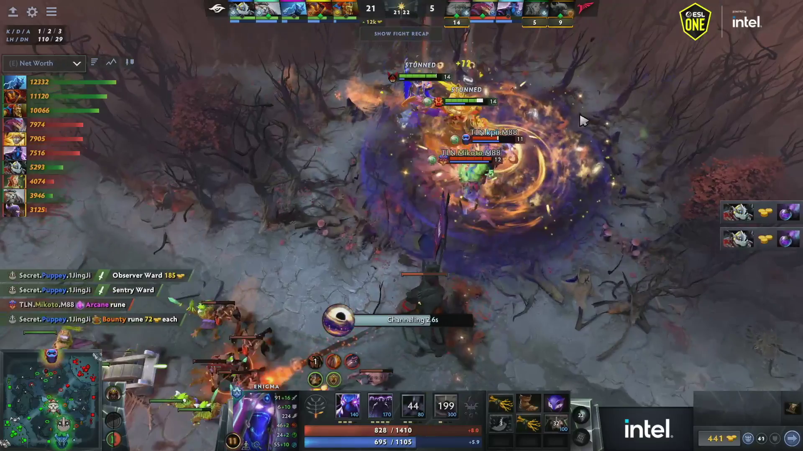

# TwitchClipMatchFinder

This tool takes a twitch clip of someone playing dota and finds the match (match id) of dota that they were playing so you can get a dotabuff/opendota link or retrieve stats for it. I've created a reddit bot that automatically finds clips posted and gets matches for them: [/u/DotaClipMatchFinder](https://www.reddit.com/user/DotaClipMatchFinder) (The name is slightly different because TwitchClipMatchFinder was too many characters)

## Example

### Input
- Reddit Post: https://redd.it/wx4rug
- Twitch Clip: http://clips.twitch.tv/TriangularFastAirGuitarVoteNay-mdiGdPRgYchBsZ3w (Note: link may have expired)
- Heres an example image taken from the above video clip:


### Output
The bot generates output that looks like this:
> Looks like this is match 6723135798, Team Secret vs Talon at ESL One Malaysia 2022 powered by Intel, which started 39 minutes before the clip was taken.
> 
> More match details here:
> - [OpenDota](https://www.opendota.com/matches/6723135798)
> - [Dotabuff](https://www.dotabuff.com/matches/6723135798)
> - [Stratz](https://www.stratz.com/matches/6723135798)
> - [datdota](https://www.datdota.com/matches/6723135798)


## How it works

- Get some info about the clip [via the twitch api](https://dev.twitch.tv/docs/api/reference)
- Download the mp4 of the clip
- Extract the first frame of the mp4 (using [OpenCV](https://opencv.org/))
- Find the heroes in the top bar of the image
    - First, crop the image to only look at the top row where the heroes should be
    - Make sure when cropping to account for the black bar that is at the top of the image of some clips
    - Load all the hero images (plus arcana images)
    - Check if the hero is in the given image and if so, where (using [OpenCV](https://opencv.org/))
    - Filter out heroes that are in the wrong place in the image
    - Sort the results to get the 10 heroes that are most likely in this image in the right order
    - Do a bunch of other things to make sure we got the right heroes in the right places, because computers are bad at pattern detection
- Use [this opendota api endpoint](https://docs.opendota.com/#tag/findMatches) to search for matches containing exactly this hero matchup
- Pick the correct match out of the results based on which one has a start time closest to the time that the clip was taken


## Libraries used

- [Twitch API](https://dev.twitch.tv/docs/api/reference)
- [Opendota API](https://docs.opendota.com/#tag/findMatches)
- [Python PIL / Pillow](https://pillow.readthedocs.io/en/stable/)
- [OpenCV](https://opencv.org/) (this one requires you do `apt install python3-opencv`)

## Usage

This library was built with the idea of using it as a reddit bot, which is its main use, but it can also be used separately to find specific clips. The `find_match` function in `finder.py` can be called to find the match for a given clip slug (the 'slug' is the bit at the end of the twitch clip url that is a bunch of words together.) The finder.py file can also be started directly if you give the clip slug as the argument. Here is an example for https://clips.twitch.tv/ExuberantBillowingHumanMau5:

```
> python finder.py ExuberantBillowingHumanMau5
finding for ExuberantBillowingHumanMau5
matched for the following heroes:
              Huskar:    (16, 8) {0   1.56} [0.9541687965393066]
         Lifestealer:    (79, 8) {1   1.56} [0.9161773920059204]
              Mirana:   (142, 8) {2   1.56} [0.9785874485969543]
             Abaddon:   (205, 8) {3   1.56} [0.9478229880332947]
                 Axe:   (268, 8) {4   1.56} [0.8044984340667725]
          Omniknight:   (539, 8) {5   0.77} [0.9744465351104736]
         Earthshaker:   (602, 8) {6   1.11} [0.929298460483551]
       Faceless Void:   (665, 8) {7   1.11} [0.9520202279090881]
           Pangolier:   (728, 8) {8   0.44} [0.9074560403823853]
             Phoenix:   (791, 8) {9   0.77} [0.966294527053833]
found match 4997200445
started 12 minutes before the clip was taken.
https://www.opendota.com/matches/4997200445
```

I've also now added support for passing in youtube urls
```
> python finder.py https://www.youtube.com/watch?v=hruZPhoE4jc
contacting youtube for mp4 url...
[youtube] hruZPhoE4jc: Downloading webpage
extracting frame...
https://api.opendota.com/api/findMatches?teamA=80&teamA=2&teamA=121&teamA=105&teamA=14&teamB=106&teamB=126&teamB=86&teamB=99&teamB=107
matched for the following heroes:
          Lone Druid:    (21, 8) {0  11.56} [0.9186623096466064]
                 Axe:    (83, 8) {1   9.56} [0.8153694868087769]
          Grimstroke:   (145, 8) {2   7.56} [0.8971994519233704]
             Techies:   (207, 8) {3   5.56} [0.8951715230941772]
               Pudge:   (269, 8) {4   3.56} [0.9334858059883118]
        Ember Spirit:   (539, 8) {5   0.77} [0.9471630454063416]
         Void Spirit:   (601, 8) {6   3.11} [0.853003740310669]
              Rubick:   (663, 8) {7   5.11} [0.930595874786377]
         Bristleback:   (725, 8) {8   6.44} [0.8776403069496155]
        Earth Spirit:   (787, 8) {9   8.77} [0.9303072690963745]
found match 6452347930
started 971 minutes before the clip was taken.
https://www.opendota.com/matches/6452347930
```

### config.json

To run finder.py from this repo, you'll need to create a `config.json` file, and place it in the same directory as finder.py. You'll need to [register an "application"](https://dev.twitch.tv/docs/authentication#registration) with the twitch api (doesnt cost money or take too long). With the client id and the client secret that they give you, you should be able to run the script. The file should look roughly like the following:
```json
{
	"twitch": {
		"client_id": "<client_id_here>",
		"client_secret": "<client_secret_here>"
	}
}
```